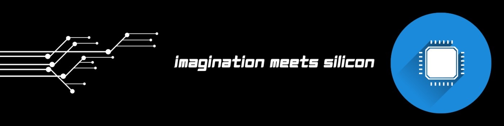

<h1 align="center">Hi, I'm Harshvardhan Singh</h1>
<h3 align="center">RTL Design Intern | Electronics & VLSI Enthusiast from India</h3>

I'm a B.Tech graduate in Electronics and Communication Engineering, currently working as an RTL Design Intern. I enjoy building digital hardware systems and learning how things work from the ground up—from writing RTL and implementing designs on FPGAs to understanding the complete digital design flow.

My interests include RTL design, FPGA development, computer architecture, digital design, and VLSI. Through my projects, I enjoy exploring how hardware is designed, optimized, and brought from specification to implementation.

<h3 align="left"> Currently exploring</h3>

- RTL design and FPGA development
- Synthesis and timing-driven digital design
- Lint, CDC, and static design analysis
- Low-power design techniques
- Digital design optimization and implementation flows

<h3 align="left">Languages and Tools</h3>

  
  
  
  
  
  
  
   
  
  

  
  
  

  

  
  
   
  
  

  

  

  

  

  

  

  

  

  
  

  

<h3 align="left">Email </h3>

  

<h3 align="left">Linkedin </h3> 

  

 

  

